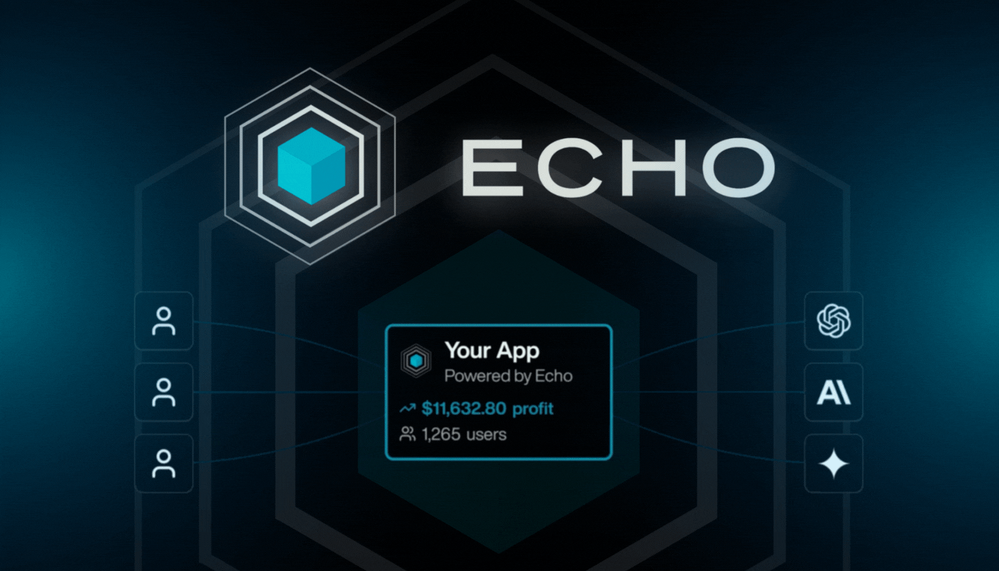

<div align="center">
  
# Echo

</div>

  <div align="center">
    
  [](https://discord.gg/merit) 
   
  [](https://github.com/Merit-Systems/echo) 
  [](https://opensource.org/licenses/Apache-2.0)

  </div>

From Vercel AI SDK to Revenue in 5 Lines

Replace your OpenAI import with Echo. Get instant OAuth, user accounts, and usage billing.

[Read the docs](https://echo.merit.systems/docs) to get started or [read our announcement](https://www.merit.systems/blog/echo) to learn more.

Consider giving a star on GitHub!

## Why Echo?

**Skip the complexity** - No API keys to manage, no auth flows to build, no payment processing to set up. Go live in minutes.

**OAuth magic** - Users sign in once, get a universal balance that works across all Echo apps.

**Universal balance** - Your users' credits work across every Echo-powered app they use.

**Simplified payouts** - Revenue hits your GitHub account directly. No Stripe dashboard, no merchant accounts. [Learn more](https://www.merit.systems/docs).

## Core

- [Echo Control](./packages/app/control): Next.js app for [echo.merit.systems](https://echo.merit.systems). Hosted site and api routes.
- [Echo Server](./packages/app/server): Express server for router.echo.merit.systems. Proxy for routing and metering LLM requests from clients.

## SDKs

- [Echo TS SDK](./packages/sdk/ts) Typescript SDK that all the framework specific SDKs are built on top of.
- [Echo Next.js SDK](./packages/sdk/next) SDK for simple Next.js 15+ App Router integration.
- [Echo React SDK](./packages/sdk/react) SDK for simple React client side SPA integration.

## Examples

- [Echo Next.js Example](./packages/sdk/examples/next)
- [Echo React SDK](./packages/sdk/examples/vite)

## Templates

Get started quickly with `echo-start`:

```bash
npx echo-start my-app
```

Available templates:

- **[next](./templates/next)** - Next.js application with Echo
- **[react](./templates/react)** - Vite React application with Echo
- **[nextjsChatbot](./templates/nextjs-chatbot)** - Next.js with Echo and Vercel AI SDK
- **[assistantUi](./templates/assistant-ui)** - Next.js with Echo and Assistant UI

Or run `npx echo-start my-app` to choose interactively.

# Development

Fill out `packages/app/control/.env` and `packages/app/server/.env`. Then...

- `pnpm i`
- `pnpm dev`
