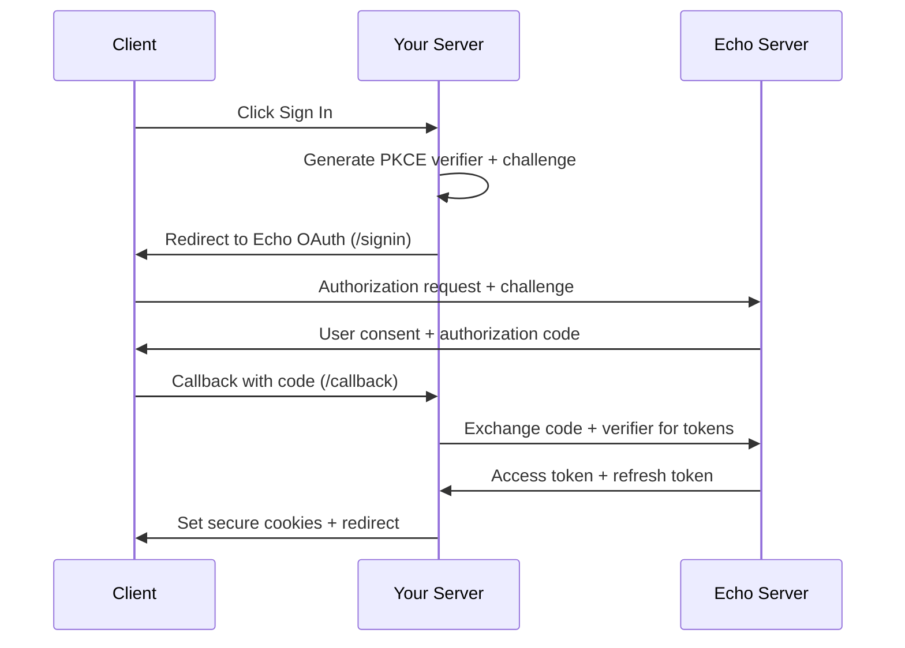

import { Callout } from 'fumadocs-ui/components/callout';

# Authentication

Echo Next.js SDK implements OAuth2 + PKCE for secure authentication without API key exposure. All tokens are stored in secure HTTP-only cookies with automatic refresh handling.

## OAuth2 + PKCE Flow

### Complete Authentication Process



### PKCE Security Implementation

The SDK generates cryptographically secure PKCE parameters:

```typescript
// Automatic PKCE generation in handleSignIn
const codeVerifier = generateCodeVerifier(); // 128 random bytes
const codeChallenge = await generateCodeChallenge(codeVerifier); // SHA256 hash

// Authorization request includes:
const authUrl = new URL('/api/oauth/authorize', ECHO_BASE_URL);
authUrl.searchParams.set('code_challenge', codeChallenge);
authUrl.searchParams.set('code_challenge_method', 'S256');
```

**Security Benefits:**
- **Code Interception Protection**: PKCE prevents authorization code interception attacks
- **No Client Secret**: Public client pattern eliminates secret management
- **Cryptographic Verification**: SHA256 ensures code verifier integrity

## Server-Side Authentication

### Authentication State Checking

```typescript
import Echo from '@merit-systems/echo-next-sdk';

const { isSignedIn, getUser } = Echo({ appId: 'your-echo-app-id' });

export default async function ProtectedPage() {
  // Fast authentication check (no network call)
  const authenticated = await isSignedIn();
  
  if (!authenticated) {
    return <SignInComponent />;
  }
  
  // Get full user information (API call)
  const user = await getUser();
  
  return <AuthenticatedContent user={user} />;
}
```

### Authentication Functions

**Function Details:**

- `isSignedIn(): Promise<boolean>` - Validates refresh token expiry from cookies (no API call)
- `getUser(): Promise<User | null>` - Fetches current user info using access token (API call)

Both functions are part of the `EchoResult` returned by the main `Echo()` function.

<Callout type="warn">
`getUser()` does not automatically refresh expired tokens. Use `isSignedIn()` first or handle null returns.
</Callout>

### Layout-Level Authentication

```typescript title="app/layout.tsx"
import Echo from '@merit-systems/echo-next-sdk';
import AuthGuard from './components/auth-guard';

const { isSignedIn } = Echo({ appId: 'your-echo-app-id' });

export default async function RootLayout({
  children,
}: {
  children: React.ReactNode;
}) {
  const authenticated = await isSignedIn();
  
  return (
    <html>
      <body>
        <AuthGuard authenticated={authenticated}>
          {children}
        </AuthGuard>
      </body>
    </html>
  );
}
```

## Client-Side Authentication

### Authentication Triggers

```typescript title="components/sign-in.tsx"
'use client';
import { signIn } from '@merit-systems/echo-next-sdk/client';

export default function SignInButton() {
  return (
    <button 
      onClick={() => signIn()}
      className="bg-blue-600 text-white px-4 py-2 rounded"
    >
      Sign In with Echo
    </button>
  );
}
```

### Client-Side Functions

```typescript
import { signIn, refreshToken } from '@merit-systems/echo-next-sdk/client';

// Initiate OAuth flow
signIn(); // Redirects to /api/echo/signin

// Force token refresh  
refreshToken(); // Redirects to /api/echo/refresh
```

<Callout type="info">
Client-side functions trigger redirects to OAuth endpoints. Use sparingly as they cause page navigation.
</Callout>

## Token Management

### Automatic Token Refresh

Providers automatically handle token refresh:

```typescript
import Echo from '@merit-systems/echo-next-sdk';

const { openai } = Echo({ appId: 'your-echo-app-id' });

// Token refresh happens automatically if needed
const model = await openai('gpt-4'); // May refresh token internally
```

### Token Lifecycle

**Access Tokens:**
- **Duration**: 1 hour
- **Storage**: HTTP-only cookie (`echo_access_token`)
- **Refresh**: Automatic in provider calls using 30-second buffer

**Refresh Tokens:**  
- **Duration**: 30 days
- **Storage**: HTTP-only cookie (`echo_refresh_token`)
- **Usage**: Exchange for new access tokens when expired

### Token Expiry Handling

```typescript
import Echo from '@merit-systems/echo-next-sdk';

const { isSignedIn, getUser } = Echo({ appId: 'your-echo-app-id' });

export default async function UserProfile() {
  // Check if refresh token is still valid
  if (!(await isSignedIn())) {
    return <SignIn />;
  }
  
  // This may return null if access token expired and refresh fails
  const user = await getUser();
  
  if (!user) {
    return <SignIn />; // Handle authentication failure
  }
  
  return <Profile user={user} />;
}
```

## Cookie Security

### Secure Cookie Configuration

All authentication cookies use secure attributes:

```typescript
// Cookie settings (internal)
{
  httpOnly: true,        // Prevents XSS access
  secure: true,          // HTTPS only in production
  sameSite: 'lax',       // CSRF protection
  path: '/',             // Available app-wide
  maxAge: tokenLifetime  // Automatic expiry
}
```

### Cookie Types

**Authentication Cookies:**
- `echo_access_token` - JWT access token for API calls
- `echo_refresh_token` - Refresh token for token renewal
- `echo_refresh_token_expires` - Client-side expiry check
- `echo_code_verifier` - PKCE verifier (5-minute expiry)

<Callout type="warn">
All cookies are HTTP-only. Authentication state is only accessible server-side through SDK functions.
</Callout>

## Authentication Patterns

### Conditional Rendering

```typescript title="app/dashboard/page.tsx"
import Echo from '@merit-systems/echo-next-sdk';
import { redirect } from 'next/navigation';

const { isSignedIn } = Echo({ appId: 'your-echo-app-id' });

export default async function DashboardPage() {
  if (!(await isSignedIn())) {
    redirect('/login');
  }
  
  return <DashboardContent />;
}
```

### Parallel Authentication

```typescript title="app/page.tsx"
import Echo from '@merit-systems/echo-next-sdk';

const { isSignedIn, getUser } = Echo({ appId: 'your-echo-app-id' });

export default async function HomePage() {
  // Parallel execution for better performance
  const [authenticated, user] = await Promise.all([
    isSignedIn(),
    getUser() // May be null if tokens expired
  ]);
  
  return (
    <div>
      {authenticated ? (
        <AuthenticatedHome user={user} />
      ) : (
        <PublicHome />
      )}
    </div>
  );
}
```

### Route Protection

```typescript title="app/protected/layout.tsx"
import Echo from '@merit-systems/echo-next-sdk';
import { redirect } from 'next/navigation';

const { isSignedIn } = Echo({ appId: 'your-echo-app-id' });

export default async function ProtectedLayout({
  children
}: {
  children: React.ReactNode;
}) {
  if (!(await isSignedIn())) {
    redirect('/login');
  }
  
  return <>{children}</>;
}
```

## Error Handling

### Authentication Errors

```typescript
import Echo from '@merit-systems/echo-next-sdk';

const { getUser } = Echo({ appId: 'your-echo-app-id' });

export default async function UserPage() {
  try {
    const user = await getUser();
    
    if (!user) {
      return <div>Please sign in to continue</div>;
    }
    
    return <UserProfile user={user} />;
  } catch (error) {
    // Handle API errors (network, server issues)
    return <div>Authentication error. Please try again.</div>;
  }
}
```

### Token Refresh Failures

```typescript
import Echo from '@merit-systems/echo-next-sdk';

const { isSignedIn } = Echo({ appId: 'your-echo-app-id' });

export async function checkAuthStatus() {
  const authenticated = await isSignedIn();
  
  if (!authenticated) {
    // Refresh token expired or invalid
    // User needs to re-authenticate
    return { status: 'unauthenticated' };
  }
  
  return { status: 'authenticated' };
}
```

## Advanced Authentication

### Custom Authentication Logic

```typescript title="lib/auth.ts"
import Echo from '@merit-systems/echo-next-sdk';

const { isSignedIn, getUser } = Echo({ appId: 'your-echo-app-id' });

export async function requireAuth() {
  if (!(await isSignedIn())) {
    throw new Error('Authentication required');
  }
  
  const user = await getUser();
  if (!user) {
    throw new Error('Failed to get user info');
  }
  
  return user;
}

export async function getOptionalUser() {
  return (await isSignedIn()) ? await getUser() : null;
}
```

### Authentication Middleware

```typescript title="lib/auth-middleware.ts"
import { NextRequest, NextResponse } from 'next/server';
import Echo from '@merit-systems/echo-next-sdk';

const { isSignedIn } = Echo({ appId: 'your-echo-app-id' });

export async function withAuth<T>(
  handler: (req: NextRequest) => Promise<T>,
  req: NextRequest
): Promise<T | NextResponse> {
  if (!(await isSignedIn())) {
    return NextResponse.redirect(new URL('/login', req.url));
  }
  
  return handler(req);
}
```