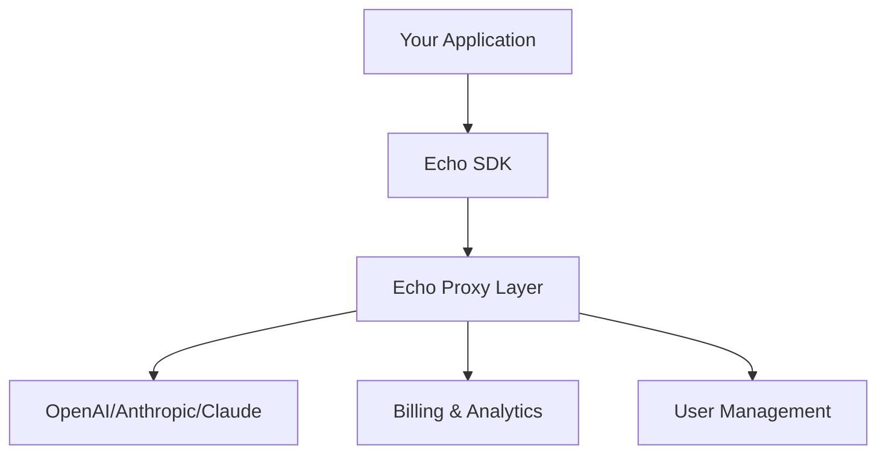

import { Callout } from 'fumadocs-ui/components/callout';

# How Echo Works

Echo is a proxy layer that handles authentication, metering, and billing for LLM applications. This guide explains the technical architecture and integration patterns.

## System Overview & Architecture

Echo operates as a three-layer stack that sits between your application and LLM providers:



### Core Components

**Echo Control** (`packages/app/control`)
- Web dashboard for app management, user analytics, billing
- PostgreSQL database with Prisma ORM
- NextAuth sessions for web UI authentication

**Echo Server** (`packages/app/server`)  
- API proxy that intercepts LLM requests
- Handles authentication validation and usage metering
- Routes requests to appropriate LLM providers
- Records transactions and calculates costs in real-time

**SDK Ecosystem**
- `echo-typescript-sdk`: Universal client for all platforms
- `echo-react-sdk`: OAuth2+PKCE for client-side LLM calls  
- `echo-next-sdk`: Server-side integration patterns

### Request Flow

Every LLM request follows this path:

1. **Authentication**: SDK includes API key or JWT token
2. **Validation**: Echo proxy validates credentials and permissions
3. **Routing**: Request forwarded to appropriate LLM provider
4. **Metering**: Response tokens counted and costs calculated
5. **Billing**: Transaction recorded with user/app attribution
6. **Response**: LLM response returned to your application

<Callout type="info">
Echo acts as a transparent proxy. Your application uses standard OpenAI SDK patterns but gains billing, analytics, and user management automatically.
</Callout>

## The Proxy Layer

Echo Server handles the complex middleware between your app and LLM providers. Here's how each component works:

### Request Interception

All LLM requests route through Echo's proxy endpoints:

```typescript
// Your app calls this
const response = await openai.chat.completions.create({
  model: "gpt-4",
  messages: [{ role: "user", content: "Hello" }]
});

// Echo intercepts at https://echo.router.merit.systems/v1/chat/completions
// Validates auth, meters usage, forwards to OpenAI, records billing
```

The proxy preserves OpenAI's API contract while injecting billing logic:

```typescript
// echo-server/src/routes/chat/completions.ts
export async function handleChatCompletion(request: AuthenticatedRequest) {
  // 1. Extract and validate authentication
  const { user, echoApp } = request.auth;
  
  // 2. Forward to LLM provider
  const llmResponse = await provider.chat.completions.create(request.body);
  
  // 3. Calculate costs from token usage
  const cost = calculateTokenCost(llmResponse.usage, request.body.model);
  
  // 4. Record transaction
  await recordTransaction({
    userId: user.id,
    echoAppId: echoApp.id,
    cost,
    tokens: llmResponse.usage
  });
  
  return llmResponse;
}
```


## Authentication & Security Architecture

Echo supports two distinct authentication patterns optimized for different use cases:

### API Key Authentication (Backend/Server-Side)

Traditional server-side pattern for backend applications:

```typescript
// Your server code
import { EchoClient } from '@merit-systems/echo-typescript-sdk';

const client = new EchoClient({
  apiKey: process.env.ECHO_API_KEY // Scoped to specific Echo app
});

const response = await client.models.chatCompletion({
  model: "gpt-4",
  messages: [{ role: "user", content: "Hello" }]
});
```

API key validation flow:

1. Extract key from `Authorization: Bearer <key>` header
2. Hash and lookup in database with app association
3. Validate key is active and app is not archived
4. Attach user and app context to request

### OAuth2 + PKCE Authentication (Frontend/Client-Side)

Pattern that enables secure LLM calls directly from browsers:

```typescript
// React component - no API keys needed
import { useEchoOpenAI } from '@merit-systems/echo-react-sdk';

function ChatComponent() {
  const { openai, isReady } = useEchoOpenAI();
  
  // This runs in the browser with user-scoped JWT tokens
  const response = await openai.chat.completions.create({
    model: "gpt-4", 
    messages: [{ role: "user", content: "Hello" }]
  });
}
```

OAuth2 + PKCE flow eliminates API key exposure:

1. **Authorization Request**: User redirects to Echo OAuth endpoint
2. **User Consent**: User authorizes your app to access their Echo balance
3. **Code Exchange**: Your app exchanges authorization code for JWT tokens
4. **Token Usage**: Short-lived JWTs authenticate LLM requests
5. **Automatic Refresh**: SDK handles token renewal transparently

This dual authentication model supports both traditional backend patterns and modern frontend architectures while maintaining security and proper billing attribution.